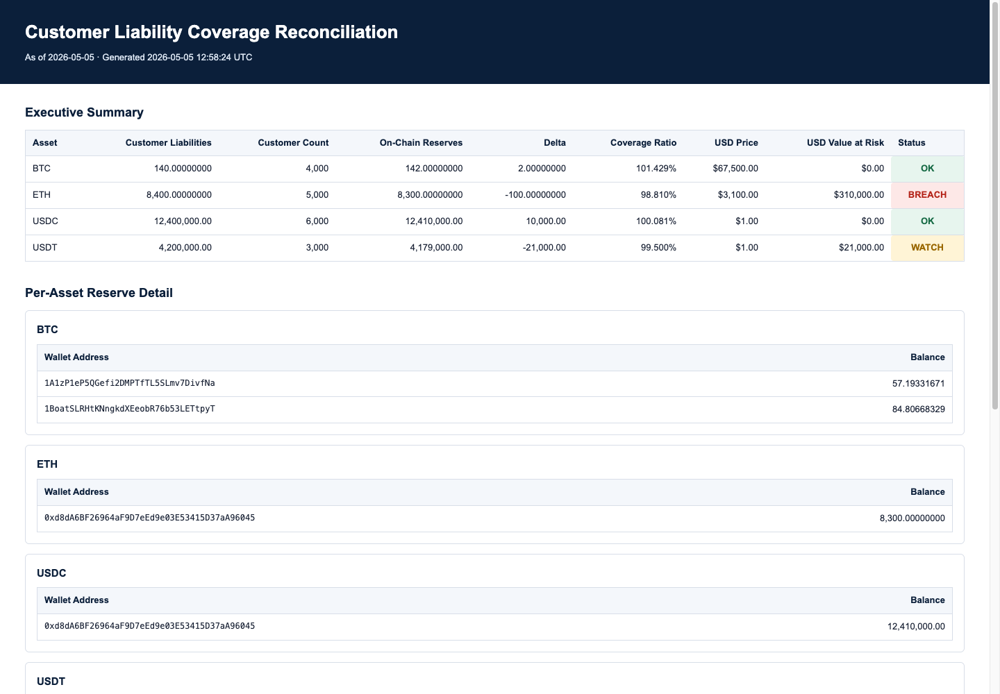
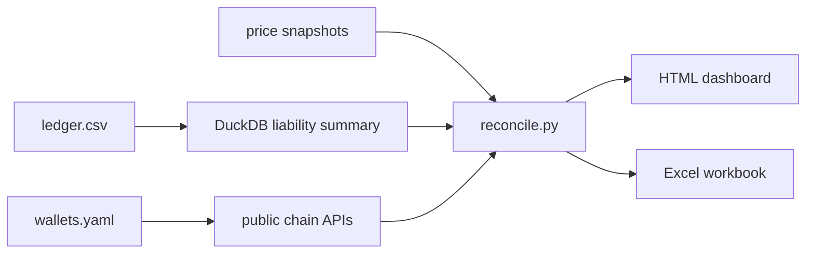

# Customer Liability Coverage Reconciliation

> A daily reserve coverage reconciliation tool: compares a synthetic exchange's
> customer-liability ledger against public on-chain wallet balances and flags
> coverage breaches.
>
> Built as a portfolio demonstration to mirror the daily safeguarding workflow
> at a regulated crypto exchange. Synthetic data; not an audit of any real entity.

[](https://github.com/<operator>/customer-liability-recon/actions/workflows/ci.yml)


## What it does

1. Aggregates customer liabilities by asset from a 10,000-row synthetic ledger
   using DuckDB SQL.
2. Pulls live reserve-wallet balances from public block explorers
   (mempool.space for BTC, Etherscan for ETH and ERC-20s).
3. Computes per-asset coverage ratios, flags exceptions (OK / WATCH / BREACH),
   and renders both an HTML treasury dashboard and an Excel workbook.

## Sample output



## Architecture



## Run it locally

```bash
git clone https://github.com/<operator>/customer-liability-recon.git
cd customer-liability-recon
python3 -m venv .venv
source .venv/bin/activate
cp .env.example .env
# Add your free Etherscan API key to .env, or export ETHERSCAN_API_KEY in your shell.
make install
make demo
```

Output lands in `output/recon_<date>.html` and `output/recon_<date>.xlsx`.

## How it's structured

`src/ledger.py` generates and validates the synthetic customer ledger, while
`src/sql/liability_summary.sql` performs the DuckDB aggregation. `src/chain.py`
fetches public wallet balances with retry, rate limiting, and SQLite caching.
`src/reconcile.py` applies the treasury logic, and `src/report.py` renders the
HTML and Excel outputs.

## Tests and CI

`make test` runs the suite. Every push runs lint + tests in CI. A scheduled
workflow runs the reconciliation daily at 13:00 UTC and commits the new report.

For the daily workflow, add `ETHERSCAN_API_KEY` as a repository secret and allow
GitHub Actions to write repository contents. The workflow uses `contents: write`
and force-adds report files because local generated reports are ignored.

## Design choices and limitations

- The customer ledger is synthetic. Real exchanges have far more assets and
  more complex liability structures, including margin, futures, staking rewards,
  and custodial versus non-custodial balances.
- Wallet addresses are public block-explorer demo data, not a real exchange's
  reserves. Choosing wallets tagged as belonging to a specific exchange would
  be misleading.
- Price snapshots are static. A production system would integrate with a
  controlled price source or oracle.
- Coverage thresholds (OK >= 100%, WATCH >= 99%, BREACH < 99%) are illustrative.
  Real thresholds are set by regulation, internal risk appetite, and control
  design.
- This is a portfolio demonstration, not a proof-of-reserves attestation or a
  claim about any institution's solvency.

## Why I built this

I built this portfolio demonstration to connect bank operations experience with
crypto-native treasury controls. The project mirrors the daily muscle of a
regulated operations team: gather source data, reconcile balances, surface
exceptions, and produce evidence that a reviewer can understand quickly.

## License

MIT

