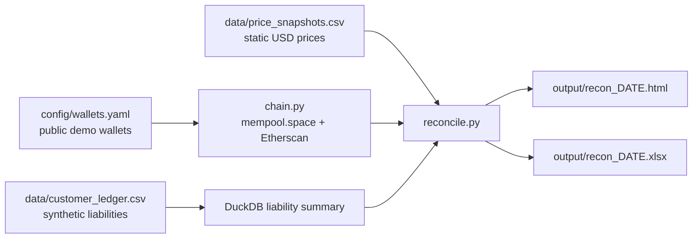

# Architecture

Customer Liability Coverage Reconciliation is a compact portfolio demonstration of a daily treasury control: compare synthetic customer liabilities to public on-chain reserve balances, then produce exception-ready reports.

## Components

- `ledger.py` generates and validates the synthetic customer ledger, then delegates liability aggregation to `src/sql/liability_summary.sql`.
- `chain.py` fetches BTC, ETH, USDC, and USDT balances from public block-explorer APIs with retry, rate limiting, and a SQLite response cache.
- `reconcile.py` converts liabilities, reserves, and static prices into coverage rows with OK/WATCH/BREACH status.
- `report.py` renders the same reconciliation into a print-friendly HTML dashboard and an Excel workbook.

## Control Framing

This is not a real exchange audit. The customer ledger is synthetic, the wallets are public demo addresses, and the prices are static. The goal is to mirror the shape of a regulated treasury workflow: source data, reconcile, flag exceptions, preserve evidence, and make the output reviewable by operations and finance stakeholders.

